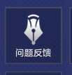
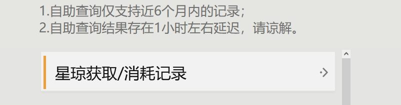
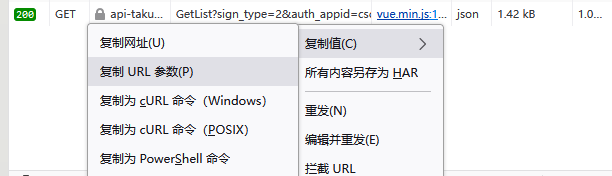

1. ESC 

2.  按F12打开开发者工具, 选择`网络`选项卡

3. 

4. 

> https://api-takumi.mihoyo.com/common/hkrpg_self_help_inquiry/Stellar/GetList?xxxxxxxxxxxxxxx&page=1&page_size=100

把最后的`&page=1&page_size=10`这部分里的`page=1`改成`&page={0}&page_size=100`

遗器类似